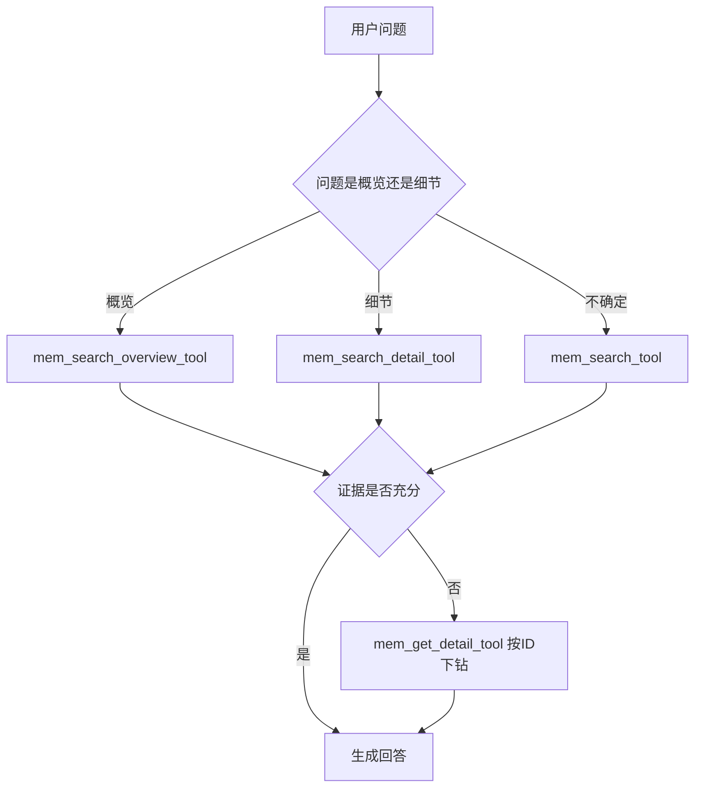

# astrbot_plugin_engram 函数工具改造记录

## 1. 背景与目标

本次改造围绕插件中的记忆工具链展开，目标是：

1. 按 AstrBot 装饰器规范实现工具注册与参数注释解析。
2. 让工具检索可在“自动注入之外”独立重检索，减少误命中。
3. 增加时间维度与记忆层级维度筛选能力。
4. 把功能拆成多工具，而不是把所有逻辑塞进单个工具。

---

## 2. 讨论结论（你提出的核心思路）

### 2.1 工具应支持二段式检索

先做记忆检索，再按命中 ID 下钻原文，避免模型在证据不足时硬答。

- 先检索：[`EngramPlugin.mem_search_tool()`](main.py:387)
- 再下钻：[`EngramPlugin.mem_get_detail_tool()`](main.py:472)

### 2.2 自动注入可参考，但工具检索应允许“重新检索”

自动注入逻辑仍保留，但工具调用时要支持独立的时间与类型筛选。

- 自动注入入口：[`EngramPlugin.on_llm_request()`](main.py:299)
- 工具检索核心：[`MemoryManager.retrieve_memories()`](core/memory_manager.py:881)

### 2.3 时间维度是刚需

支持“昨天/前天”等相对时间，以及 `2026/1/15-2026/2/11` 这类显式时间区间。

- 时间解析实现：[`EngramPlugin._parse_time_expr()`](main.py:89)

### 2.4 多工具拆分比单工具堆叠更可控

最终采用“通用 + 概览 + 细节 + 下钻”的多工具结构。

---

## 3. 实际已完成改造

## 3.1 工具注释与注册规范化

工具使用装饰器注册，并以可解析注释定义参数类型（`string/number/array[string]` 风格）。

- 通用检索工具：[`@filter.llm_tool(name="mem_search_tool")`](main.py:386)
- 概览检索工具：[`@filter.llm_tool(name="mem_search_overview_tool")`](main.py:414)
- 细节检索工具：[`@filter.llm_tool(name="mem_search_detail_tool")`](main.py:443)
- 原文下钻工具：[`@filter.llm_tool(name="mem_get_detail_tool")`](main.py:471)

---

## 3.2 新增“按 ID 下钻原文”能力

新增并稳定化详情工具，可根据短 ID/完整 ID 返回完整原始对话链路。

- 入口：[`EngramPlugin.mem_get_detail_tool()`](main.py:472)
- 调用能力：[`MemoryFacade.get_memory_detail_by_id()`](core/memory_facade.py:146)
- 核心实现：[`MemoryManager.get_memory_detail_by_id()`](core/memory_manager.py:1297)

---

## 3.3 为检索加入时间与类型筛选

### main 层

- 工具参数新增：`time_expr`、`source_types`（以注释形式对 LLM 暴露）
  - [`EngramPlugin.mem_search_tool()`](main.py:387)
- 时间表达式解析：
  - [`EngramPlugin._parse_time_expr()`](main.py:89)
- 类型归一化（支持数组和逗号字符串）：
  - [`EngramPlugin._normalize_source_types()`](main.py:199)
- 统一检索输出封装（复用于多个工具）：
  - [`EngramPlugin._build_memory_search_output()`](main.py:224)

### facade 层

- 透传新增过滤参数：
  - [`MemoryFacade.retrieve_memories()`](core/memory_facade.py:131)

### manager 层

- 扩展检索签名，支持 `start_time/end_time/source_types`：
  - [`MemoryManager.retrieve_memories()`](core/memory_manager.py:881)
- 在向量库检索前构建 `where` 过滤，包含用户与来源类型：
  - [`where_filter` 构建逻辑](core/memory_manager.py:894)
- 在排序前按 DB `created_at` 做时间窗口过滤，提升准确性：
  - [`时间过滤逻辑`](core/memory_manager.py:1039)

---

## 3.4 拆分为多工具（本次核心重构）

## 工具矩阵

1. 通用检索
   - [`EngramPlugin.mem_search_tool()`](main.py:387)
   - 适用于不确定场景。

2. 概览检索（默认 monthly/yearly）
   - [`EngramPlugin.mem_search_overview_tool()`](main.py:415)
   - 适用于“几个月前/长期趋势/阶段总结”。

3. 细节检索（默认 private/daily_summary/weekly）
   - [`EngramPlugin.mem_search_detail_tool()`](main.py:444)
   - 适用于“昨天/前天/某次具体发生了什么”。

4. 原文下钻
   - [`EngramPlugin.mem_get_detail_tool()`](main.py:472)
   - 适用于对某条命中记忆继续取证。

---

## 3.5 工具提示词已同步更新

系统注入时会提示模型优先使用概览/细节工具，并说明参数。

- 提示注入位置：[`tool_hint_block`](main.py:355)

---

## 4. 当前推荐调用策略

---

## 5. 已验证项

- 代码可编译通过：[`main.py`](main.py)、[`memory_facade.py`](core/memory_facade.py)、[`memory_manager.py`](core/memory_manager.py)。
- 检索链路已支持：
  - 时间表达式筛选
  - 来源层级筛选
  - 按 ID 原文下钻
  - 多工具分工调用

---

## 6. 后续可选优化（未做）

1. 增加“近 N 月/近 N 年”自然语言解析。
2. 为概览工具添加“默认不带原文预览”的专门渲染分支（进一步降低噪声）。
3. 增加工具级调用预算与短期缓存（你已明确当前阶段先不做性能治理）。
