# astrbot_plugin_engram 主流程时序文档

## 1. 文档目的

本文档描述 `astrbot_plugin_engram` 的核心运行时流程，重点说明：

- 消息是如何进入记忆系统的
- 长期记忆是如何归档、检索、注入的
- 用户画像是如何更新的
- 群聊链路与私聊链路有何差异
- 删除、撤销、导出、WebUI 的主要时序关系

项目路径：`E:/AI/shouban/astrbot_plugin_engram`

---

## 2. 核心参与者

为便于理解，下文统一使用以下参与者名称：

| 参与者 | 说明 |
|---|---|
| 用户 | 最终聊天对象 |
| AstrBot | 宿主框架，触发消息事件与 LLM 请求 |
| `main.py / EngramPlugin` | 插件入口与路由层 |
| `MemoryFacade` | 记忆与画像统一门面 |
| `MemoryManager` | 原始消息、归档、检索、删除、向量管理核心 |
| `ProfileManager` | 画像读写、每日更新、快照、回滚核心 |
| `DatabaseManager` | SQLite 数据访问层 |
| ChromaDB | 长期记忆向量检索层 |
| LLM Provider | 总结、画像更新、对话生成依赖的大模型 |
| `MemoryScheduler` | 后台归档、画像、维护调度器 |
| WebUI Server | 管理后台 API 层 |

---

## 3. 系统启动流程

## 3.1 流程说明

插件加载时，`EngramPlugin.__init__()` 会完成配置合并、核心对象初始化、调度器启动，以及可选的 WebUI 启动。

## 3.2 时序图

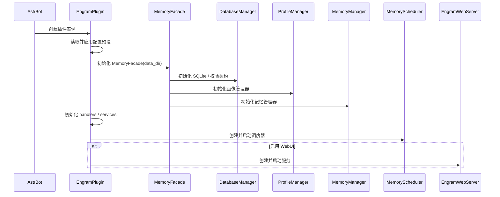

## 3.3 结果

系统启动后会形成以下长期运行能力：

- 私聊消息记录
- LLM 请求前记忆检索与 prompt 注入
- 定时归档总结
- 定时画像更新
- 记忆维护与折叠总结
- 可选 WebUI 管理端

---

## 4. 私聊消息录入流程

## 4.1 场景说明

当用户发送私聊消息时，插件会优先做“原始消息记录”，但不会立刻生成长期记忆。长期记忆由后台调度器在满足条件后异步归档。

## 4.2 时序图

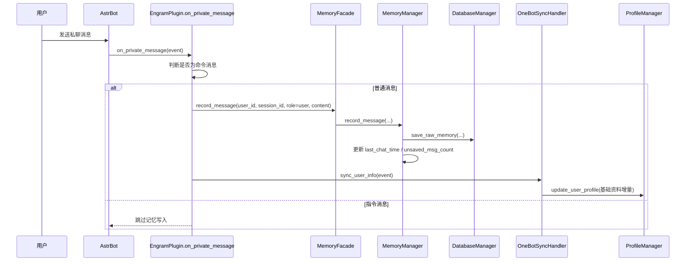

## 4.3 关键点

1. **先写原始消息，不立即总结**
2. **命令消息默认不进入记忆**
3. **用户资料同步与消息记录并行发生**
4. **原始消息是后续归档、导出、回溯的唯一事实源**

---

## 5. 私聊回复后记录流程

## 5.1 场景说明

当 AstrBot 完成回复后，插件会把 assistant 回复也写入原始消息表，并更新画像中的互动统计。

## 5.2 时序图

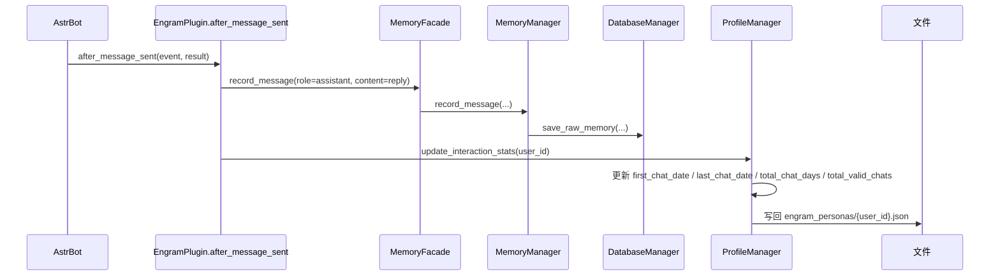

## 5.3 关键点

- 记忆系统保存的是双边对话，而非只有用户单边输入
- 画像中的互动统计在回复完成后更新，更接近一次完整交互闭环

---

## 6. LLM 请求前记忆检索与注入流程

## 6.1 场景说明

当用户发起新问题，AstrBot 即将调用大模型前，插件会判断是否需要检索长期记忆，并将画像与记忆回溯块注入到 prompt 中。

## 6.2 时序图

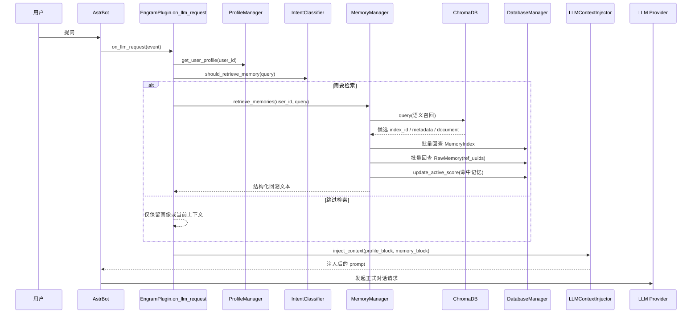

## 6.3 关键点

### 6.3.1 检索不是每次都执行

先由 `IntentClassifier` 判断消息是否值得检索，避免无意义查询浪费成本。

### 6.3.2 检索链路是“向量召回 + SQLite 回查”

Chroma 负责找候选，SQLite 负责补全：

- 摘要正文
- 前序链路 `prev_index_id`
- 原文列表 `ref_uuids`
- 活跃度加权

### 6.3.3 向量失败可降级

若 Chroma 不可用或 embedding 失败，会降级到 SQLite 关键词检索。

---

## 7. 长期记忆归档流程

## 7.1 场景说明

长期记忆不是实时生成，而是由后台调度器周期性检查。当满足“超时 + 条数阈值”后，系统才对未归档原始消息进行总结。

## 7.2 时序图

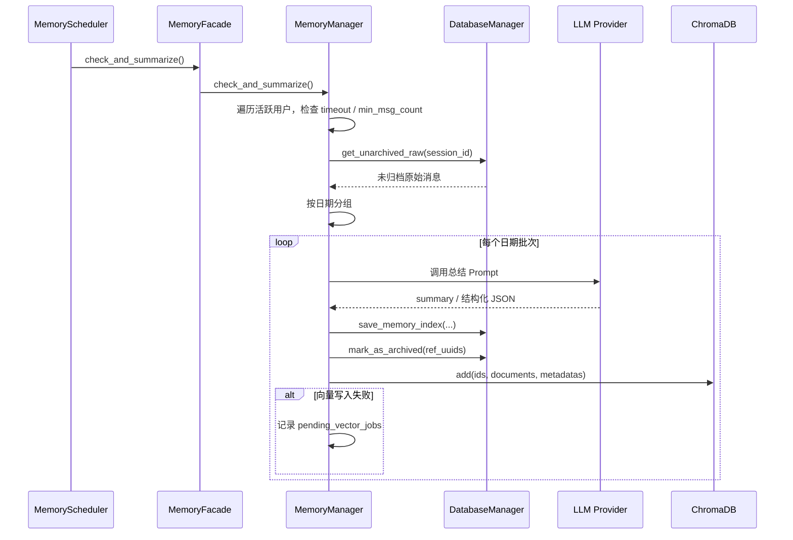

## 7.3 触发条件

典型条件：

- 距最后一次用户消息超过 `private_memory_timeout`
- 未归档消息数达到 `min_msg_count`

## 7.4 关键点

1. **按天分组总结**：避免跨日上下文过长、时间粒度混乱
2. **先写 SQLite，再写 Chroma**：主数据优先落地
3. **原始消息标记归档而非立刻删除**：便于回溯和重建
4. **新记忆通过 `prev_index_id` 串成时间链**

---

## 8. 画像每日更新流程

## 8.1 场景说明

每天由调度器对符合条件的用户进行画像深度更新，使用当天或指定时间范围的长期记忆作为输入。

## 8.2 时序图

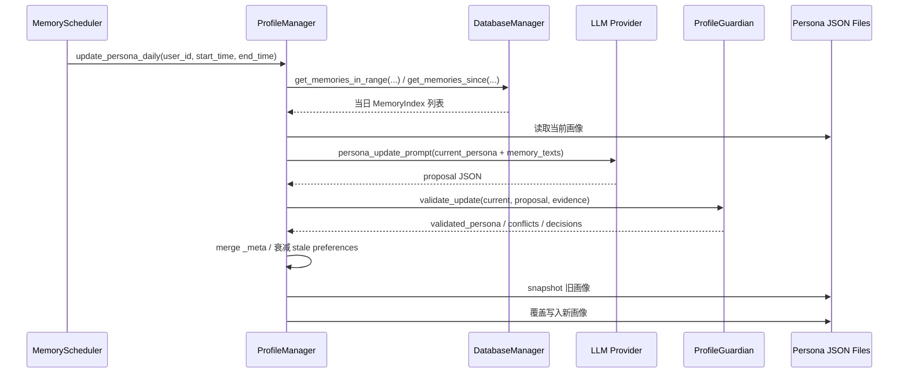

## 8.3 关键点

- 画像不是直接相信 LLM 输出，而是先经过 `ProfileGuardian`
- 写入前先做快照，支持后续回滚
- `_meta` 中会累计 accepted field 的证据链
- `likes/dislikes` 支持 TTL 衰减，防止画像老化

---

## 9. 群聊记忆流程

## 9.1 场景说明

群聊链路与私聊链路类似，但它是**按需延迟初始化**的，并使用独立 SQLite 与 Chroma 存储。

## 9.2 初始化时序图

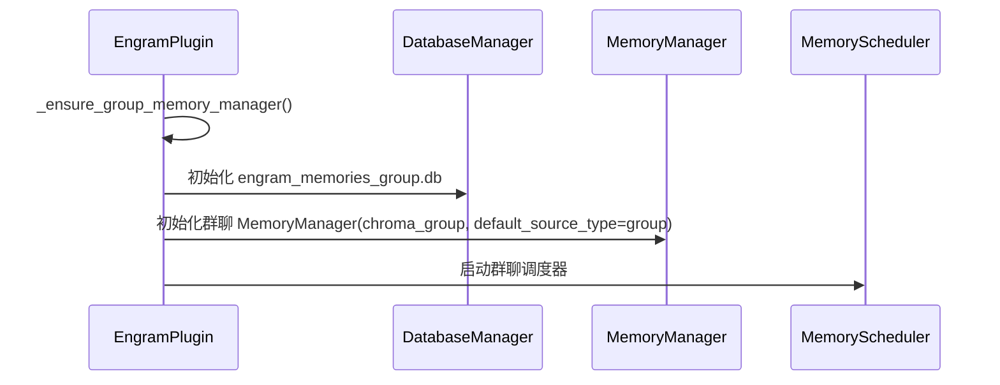

## 9.3 请求前注入时序图

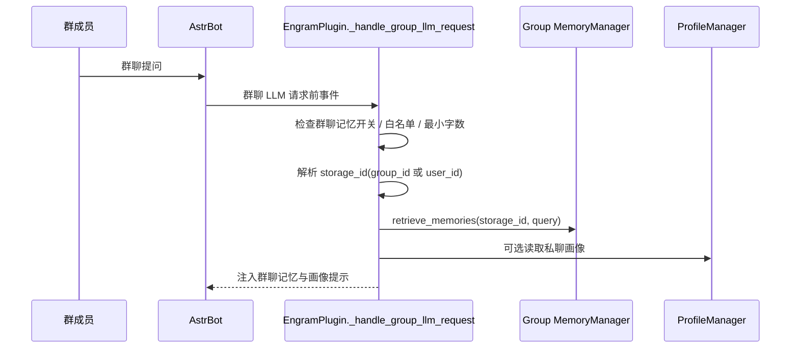

## 9.4 回复后记录时序图

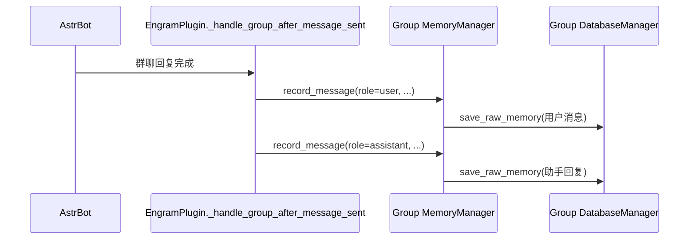

## 9.5 群聊与私聊的关键差异

| 项目 | 私聊 | 群聊 |
|---|---|---|
| 数据库 | `engram_memories.db` | `engram_memories_group.db` |
| Chroma 路径 | `engram_chroma/` | `engram_chroma_group/` |
| 初始化方式 | 插件启动即初始化 | 首次需要时延迟初始化 |
| 画像 | 完整支持 | 主要复用私聊画像，不单独维护群画像 |
| 存储归属 | `user_id` | 可配置为 `group_id` 或 `user_id` |

---

## 10. 删除与撤销流程

## 10.1 删除流程

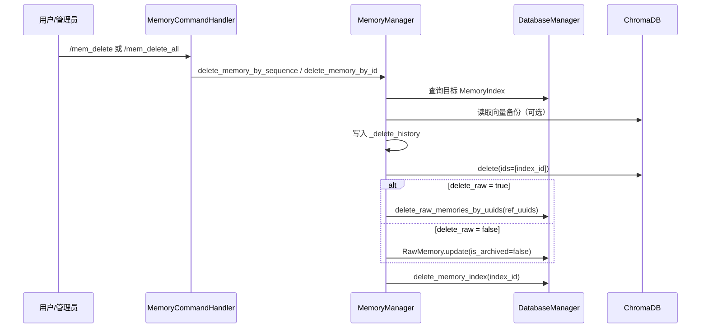

## 10.2 撤销流程

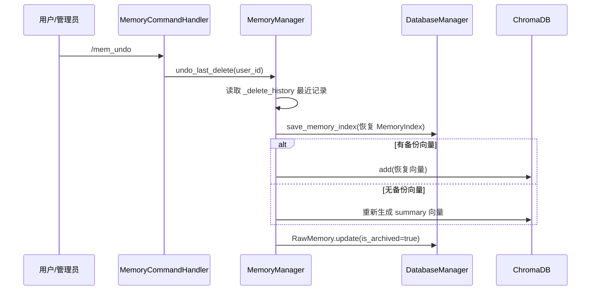

## 10.3 关键点

- 撤销历史保存在内存中，不跨重启
- 删除支持“只删索引”与“索引 + 原文一起删”两种模式
- 若保留原文，则删除长期记忆时会把原始消息重新置为未归档，便于后续再次总结

---

## 11. 数据导出流程

## 11.1 场景说明

导出命令以 `RawMemory` 为源，生成可供人工审查或模型微调的数据文件。

## 11.2 时序图

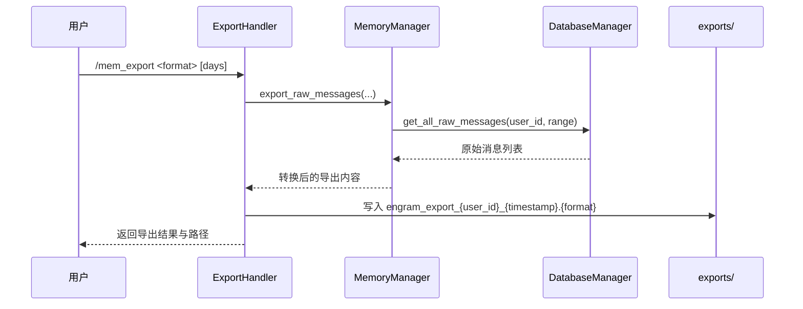

---

## 12. WebUI 查询流程

## 12.1 场景说明

WebUI 通过 `FastAPI + 线程池` 访问 SQLite、画像文件和渲染器，提供统计、记忆浏览、画像管理等能力。

## 12.2 时序图

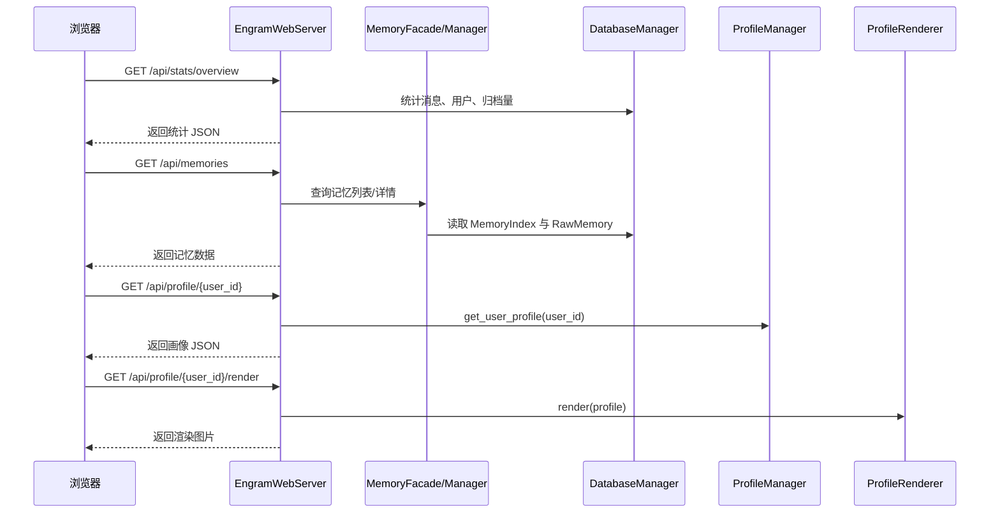

## 12.3 关键点

- 阻塞型数据库操作通过线程池执行
- 私聊与群聊统计需要分别读取再汇总
- WebUI 当前更偏运维与浏览，不是事务型后台

---

## 13. 异常与降级流程

## 13.1 向量不可用降级

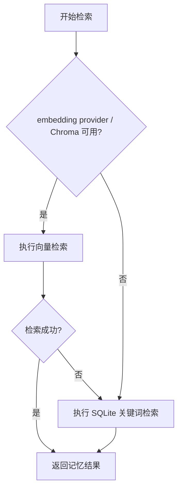

## 13.2 画像读取失败降级

- 若画像文件不存在：返回默认画像
- 若画像文件损坏：记录日志并回退默认画像
- 若历史文件损坏：回滚功能返回失败信息，但不影响主链路聊天

## 13.3 WebUI 降级

- 若 WebUI 启动失败，不影响主聊天链路
- 若群聊数据库未启用，统计页可只展示私聊数据

---

## 14. 一页式主流程总览

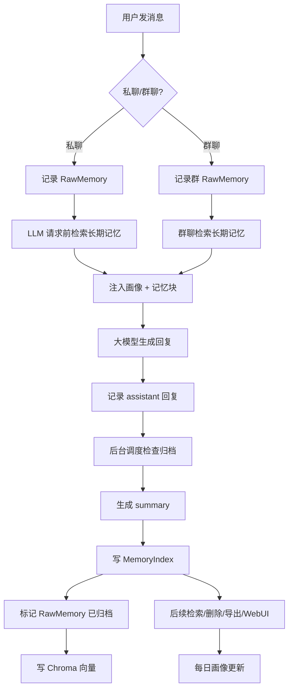

---

## 15. 一句话总结

`astrbot_plugin_engram` 的主链路可以概括为：

**先把对话完整保存为原始消息，再由后台异步沉淀成长期记忆，并在下一次对话前把“画像 + 记忆回溯”重新注入给 LLM。**
