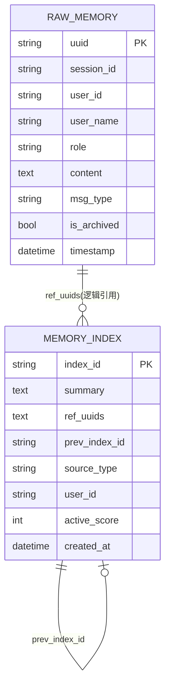
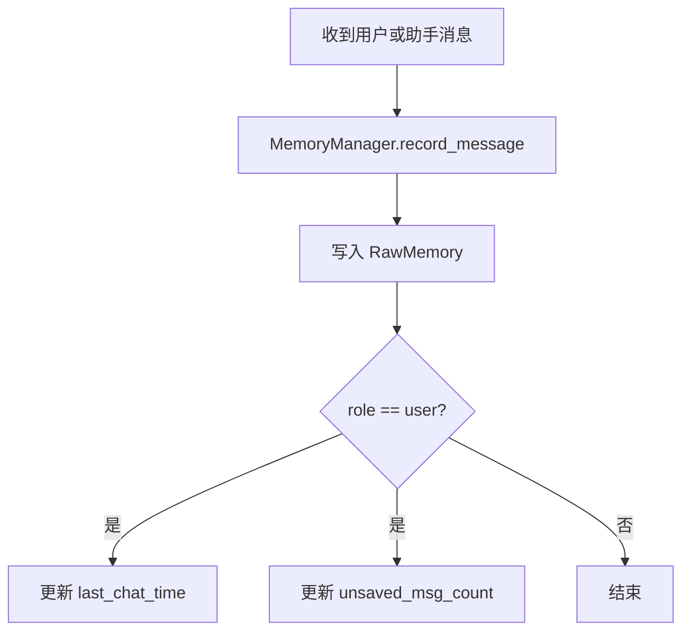
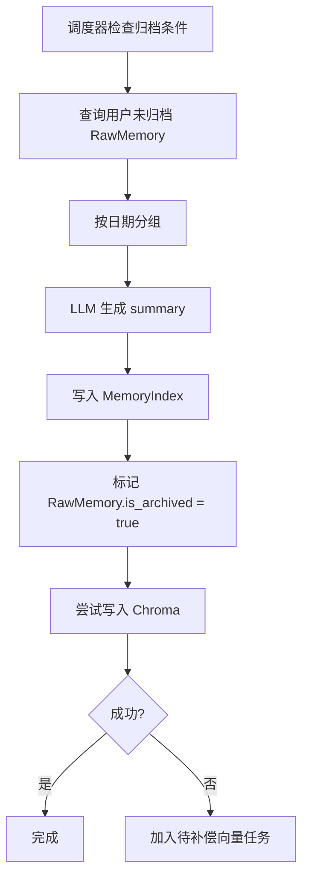
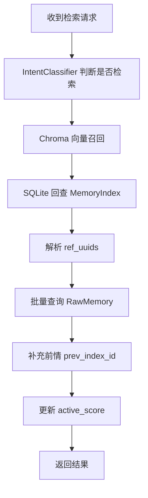

# astrbot_plugin_engram 数据库设计文档

## 1. 文档目的

本文档说明 `astrbot_plugin_engram` 当前版本的数据存储设计、表结构、索引策略、数据流转、扩展约束与运维建议，便于：

- 项目维护者理解当前持久化方案
- 二次开发者在不破坏现有链路的前提下扩展字段或新表
- 排查记忆归档、检索、删除、回滚、画像更新等问题
- 为后续迁移、重构、性能优化提供基础资料

项目路径：`E:/AI/shouban/astrbot_plugin_engram`

---

## 2. 存储总体设计

插件采用**多存储协同**方案，而不是单一数据库：

1. **SQLite**：存储原始消息与长期记忆索引，属于主事实库
2. **ChromaDB**：存储长期记忆向量，属于语义检索加速层
3. **JSON 文件**：存储用户画像与画像历史，属于结构化用户档案层
4. **内存态缓存**：存储撤销删除历史、待补偿向量任务、近期活动等临时数据

### 2.1 数据职责划分

| 存储介质 | 路径 | 作用 | 是否主数据 |
|---|---|---|---|
| SQLite | `engram_memories.db` | 私聊原始消息、长期记忆索引 | 是 |
| SQLite | `engram_memories_group.db` | 群聊原始消息、群聊长期记忆索引 | 是 |
| ChromaDB | `engram_chroma/` | 私聊长期记忆向量索引 | 否，属派生数据 |
| ChromaDB | `engram_chroma_group/` | 群聊长期记忆向量索引 | 否，属派生数据 |
| JSON | `engram_personas/{user_id}.json` | 当前用户画像 | 是 |
| JSON | `engram_personas/history/{user_id}.json` | 画像快照历史 | 是 |
| 文件导出 | `exports/` | 微调数据导出结果 | 否 |
| 内存缓存 | 进程内 | 删除撤销历史、待补偿向量任务等 | 否 |

### 2.2 设计原则

当前实现体现了以下几个数据库设计原则：

- **SQLite 先落库，向量后写入**：避免 embedding 或 Chroma 异常导致主数据丢失
- **向量库可重建**：ChromaDB 视为 SQLite `MemoryIndex` 的派生索引，可全量重建
- **画像独立于主库**：用户画像采用 JSON 文件保存，避免频繁变动的半结构化数据污染关系表设计
- **逻辑关联优先于物理外键**：现阶段没有显式外键约束，关联靠 `user_id`、`index_id`、`ref_uuids` 维持
- **按场景分库**：私聊与群聊数据库分离，减少互相污染与后续扩展复杂度

---

## 3. 物理存储布局

默认数据目录由 AstrBot 的 `StarTools.get_data_dir()` 提供，通常为：

```text
data/plugins_data/astrbot_plugin_engram/
├── engram_memories.db
├── engram_memories_group.db
├── engram_chroma/
├── engram_chroma_group/
├── engram_personas/
│   ├── {user_id}.json
│   └── history/
│       └── {user_id}.json
└── exports/
```

### 3.1 私聊数据库

- 文件名：`engram_memories.db`
- 初始化入口：`core/memory_facade.py` → `DatabaseManager(self.data_dir)`
- 用途：私聊原始消息、私聊长期记忆、折叠总结（周/月/年）

### 3.2 群聊数据库

- 文件名：`engram_memories_group.db`
- 初始化入口：`main.py` 中按需延迟初始化
- 用途：群聊原始消息、群聊长期记忆
- 特点：仅在启用群聊记忆后创建
- 归档节奏：优先受 `group_memory_timeout` 与 `group_min_msg_count` 控制，未配置时回退到私聊归档配置

### 3.3 向量库

- 私聊：`engram_chroma/`
- 群聊：`engram_chroma_group/`
- 集合名：`long_term_memories`
- 特点：可由 SQLite 中的 `MemoryIndex` 全量重建

### 3.4 画像文件

- 当前画像：`engram_personas/{user_id}.json`
- 历史画像：`engram_personas/history/{user_id}.json`

---

## 4. SQLite 设计

SQLite 是插件的**主事实库**。当前由 `db_manager.py` 管理，并通过 Peewee ORM 建模。

### 4.1 数据库初始化参数

数据库初始化时使用 `SqliteExtDatabase`，并设置以下 pragma：

| 参数 | 值 | 说明 |
|---|---:|---|
| `journal_mode` | `wal` | 启用 WAL，提高并发读写能力 |
| `cache_size` | `-64 * 1024` | 约 64MB 页缓存 |
| `synchronous` | `1` | 对应 NORMAL，同步与性能折中 |
| `foreign_keys` | `1` | 开启外键支持，但当前模型未定义显式外键 |

### 4.2 表清单

当前 SQLite 仅包含两张核心表：

1. `rawmemory`：原始消息表
2. `memoryindex`：长期记忆索引表

> 注：实际 Peewee 默认表名为模型名小写形式，未在代码中额外显式重命名。

---

## 5. 表结构设计

## 5.1 `RawMemory` 原始消息表

### 5.1.1 设计目标

用于保存进入记忆系统的原始对话消息，是所有归档、回溯、导出、统计的基础数据源。

### 5.1.2 字段定义

| 字段名 | 类型 | 约束 | 说明 |
|---|---|---|---|
| `uuid` | `CharField` | PK | 原始消息唯一 ID |
| `session_id` | `CharField` | index | 会话 ID；私聊/群聊检索与归档分区键 |
| `user_id` | `CharField` | index | 用户 ID |
| `user_name` | `CharField` | nullable | 用户名或昵称快照 |
| `role` | `CharField` | not null | 消息角色，常见为 `user` / `assistant` |
| `content` | `TextField` | not null | 消息内容 |
| `msg_type` | `CharField` | not null | 消息类型，默认 `text` |
| `is_archived` | `BooleanField` | default `False`, index | 是否已归档进长期记忆 |
| `timestamp` | `DateTimeField` | default now, index | 原始消息时间 |

### 5.1.3 索引设计

单列索引：

- `session_id`
- `user_id`
- `is_archived`
- `timestamp`

复合索引：

- `(session_id, is_archived)`
- `(user_id, is_archived)`

### 5.1.4 设计原因

这些索引对应当前最常见查询：

- 按会话取未归档消息：用于归档触发
- 按用户取消息：用于导出、统计、清理
- 按时间排序：用于回放、导出、统计
- 按归档状态过滤：避免重复总结

### 5.1.5 典型记录示例

```json
{
  "uuid": "2eb7e91d-87b0-4f95-9c31-8f9b9db6a6a4",
  "session_id": "private_123456",
  "user_id": "123456",
  "user_name": "Alice",
  "role": "user",
  "content": "我最近在准备考研，压力有点大。",
  "msg_type": "text",
  "is_archived": false,
  "timestamp": "2026-03-19 21:13:05"
}
```

---

## 5.2 `MemoryIndex` 长期记忆索引表

### 5.2.1 设计目标

用于保存归档后的长期记忆摘要，以及它与原始消息、前序记忆、活跃度之间的关系。

### 5.2.2 字段定义

| 字段名 | 类型 | 约束 | 说明 |
|---|---|---|---|
| `index_id` | `CharField` | PK | 长期记忆唯一 ID |
| `summary` | `TextField` | not null | 记忆摘要文本 |
| `ref_uuids` | `TextField` | not null | 关联原始消息 UUID 列表，JSON 字符串存储 |
| `prev_index_id` | `CharField` | nullable, index | 前一条记忆 ID，形成时间链 |
| `source_type` | `CharField` | not null | 记忆来源类型 |
| `user_id` | `CharField` | nullable, index | 归属用户/会话主体 |
| `active_score` | `IntegerField` | default `100` | 活跃度分数，用于冷/热记忆调节 |
| `created_at` | `DateTimeField` | default now, index | 记忆创建时间 |

### 5.2.3 索引设计

单列索引：

- `prev_index_id`
- `user_id`
- `created_at`

复合索引：

- `(user_id, created_at)`

### 5.2.4 `source_type` 语义

当前代码中 `source_type` 可能出现以下值：

| 值 | 含义 |
|---|---|
| `private` | 私聊长期记忆 |
| `group` 或群聊配置值 | 群聊长期记忆 |
| `daily_summary` | 日级折叠总结 |
| `weekly` | 周级折叠总结 |
| `monthly` | 月级折叠总结 |
| `yearly` | 年级折叠总结 |

> 具体群聊值取决于配置与 `default_source_type` / `group_memory_source_type`。

### 5.2.5 设计亮点

1. **`ref_uuids` 保存原文指针**
   - 让记忆不仅有摘要，还能回溯原文
   - 当前采用 JSON 字符串数组，避免额外映射表复杂度

2. **`prev_index_id` 构造时间链**
   - 每条记忆都能找到“上一条”记忆
   - 用于前情提示与上下文连续性补充

3. **`active_score` 支持记忆冷却/强化**
   - 召回时加分
   - 定时维护时衰减
   - 支持冷记忆筛除与向量修剪

### 5.2.6 典型记录示例

```json
{
  "index_id": "70749040-efef-4e50-85a1-5efb82c7a931",
  "summary": "2026-03-19：用户提到最近在准备考研，情绪偏紧张，同时表达了对未来结果的担忧。",
  "ref_uuids": "[\"2eb7e91d-87b0-4f95-9c31-8f9b9db6a6a4\", \"540c6bd5-a442-4c6f-b1ee-0e4f92754f03\"]",
  "prev_index_id": "16ab6220-4907-48a4-9467-5f373e4330fd",
  "source_type": "private",
  "user_id": "123456",
  "active_score": 108,
  "created_at": "2026-03-19 23:59:58"
}
```

---

## 6. 逻辑关系设计

当前项目关系主要通过逻辑字段维护，而非物理外键。

### 6.1 逻辑 ER 图



### 6.2 关系说明

#### 6.2.1 原始消息 → 长期记忆

- 关系类型：多对多的压缩映射，但实现上表现为“**一条长期记忆引用多条原始消息**”
- 实现方式：`MemoryIndex.ref_uuids` 保存多个 `RawMemory.uuid`
- 说明：一个摘要通常归纳一天或一批消息

#### 6.2.2 长期记忆 → 前序长期记忆

- 关系类型：单向链表
- 实现方式：`MemoryIndex.prev_index_id`
- 作用：构造连续时间线，支持“前情提要”检索

#### 6.2.3 用户 → 原始消息 / 长期记忆 / 画像

- 关系类型：1 对多 / 1 对 1（当前画像）
- 实现方式：
  - SQLite 中通过 `user_id`
  - JSON 中通过文件名 `{user_id}.json`

---

## 7. 画像 JSON 设计

用户画像没有进入 SQLite，而是使用 JSON 文件保存。这是当前实现中非常重要的一部分“数据库设计”。

## 7.1 当前画像文件

路径：`engram_personas/{user_id}.json`

### 7.1.1 默认结构

```json
{
  "basic_info": {
    "qq_id": "123456",
    "nickname": "未知",
    "gender": "未知",
    "age": "未知",
    "location": "未知",
    "job": "未知",
    "avatar_url": "",
    "birthday": "未知",
    "constellation": "未知",
    "zodiac": "未知",
    "signature": "暂无个性签名"
  },
  "attributes": {
    "personality_tags": [],
    "hobbies": [],
    "skills": []
  },
  "preferences": {
    "favorite_foods": [],
    "favorite_items": [],
    "favorite_activities": [],
    "likes": [],
    "dislikes": []
  },
  "social_graph": {
    "relationship_status": "萍水相逢",
    "important_people": [],
    "interaction_stats": {
      "first_chat_date": null,
      "last_chat_date": null,
      "total_chat_days": 0,
      "total_valid_chats": 0
    }
  },
  "dev_metadata": {
    "os": [],
    "tech_stack": []
  },
  "shared_secrets": false,
  "pending_proposals": [],
  "_meta": {
    "updated_at": null,
    "fields": {}
  }
}
```

### 7.1.2 字段分区说明

| 顶层字段 | 作用 |
|---|---|
| `basic_info` | 基础身份信息 |
| `attributes` | 性格、爱好、技能 |
| `preferences` | 喜好、禁忌、偏好 |
| `social_graph` | 关系状态与互动统计 |
| `dev_metadata` | 偏开发者向信息 |
| `shared_secrets` | 是否有共享秘密 |
| `pending_proposals` | 防冲突暂缓接纳项 |
| `_meta` | 证据链与更新时间元数据 |

### 7.1.3 `_meta.fields` 设计

`_meta.fields` 以“字段路径”为键，记录画像证据链。例如：

```json
{
  "preferences.likes.冰美式": {
    "last_seen_at": "2026-03-19T23:30:00",
    "evidence_count": 3,
    "evidence_refs": [
      "memory_index:abc123,def456",
      "memory_index:ghi789"
    ]
  }
}
```

作用：

- 支持证据可追溯
- 支持偏好 TTL 衰减
- 支持 `/profile evidence` 展示

---

## 7.2 画像历史文件

路径：`engram_personas/history/{user_id}.json`

### 7.2.1 结构说明

历史文件是一个数组，每一项为一个快照：

```json
[
  {
    "snapshot_at": "2026-03-19T00:01:20",
    "profile": { "...": "..." }
  }
]
```

### 7.2.2 设计特点

- 按用户单文件保存
- 默认仅保留最近 `profile_history_limit` 份
- 回滚时按步数恢复旧快照

---

## 8. ChromaDB 向量设计

向量库用于长期记忆语义检索，不承担主数据职责。

## 8.1 集合设计

- 客户端：`chromadb.PersistentClient(path=...)`
- 集合名：`long_term_memories`

## 8.2 向量文档来源

Chroma 文档内容来自 `MemoryIndex.summary`。

## 8.3 元数据结构

### 8.3.1 常规记忆写入元数据

归档普通长期记忆时，写入的 metadata 结构为：

```json
{
  "user_id": "123456",
  "source_type": "private",
  "created_at": "2026-03-19 23:59:58",
  "ai_name": "xxx"
}
```

### 8.3.2 折叠总结写入元数据

折叠周/月/年总结时，会附加：

```json
{
  "user_id": "123456",
  "source_type": "weekly",
  "created_at": "2026-03-19 23:59:58",
  "ai_name": "xxx",
  "folding_days": 7,
  "folding_level": "weekly",
  "source_count": 12,
  "source_types": "daily_summary,private"
}
```

## 8.4 主键映射规则

- Chroma `id` = SQLite `MemoryIndex.index_id`
- Chroma `document` = SQLite `MemoryIndex.summary`
- Chroma `metadata.user_id` = SQLite `MemoryIndex.user_id`

因此 Chroma 本质上是 `MemoryIndex` 的语义检索镜像。

## 8.5 一致性策略

当前一致性策略为：

1. 先写 SQLite `MemoryIndex`
2. 再写 Chroma
3. 如 Chroma 写入失败：
   - 不回滚 SQLite
   - 记录待补偿向量任务
   - 可后续执行向量重建

这意味着系统采用的是**弱一致、可修复**模型，而不是强事务一致模型。

---

## 9. 核心数据流

## 9.1 原始消息写入流程



写入结果：

- SQLite `RawMemory` 新增一条记录
- 内存态会话计数更新

## 9.2 长期记忆归档流程



## 9.3 记忆检索流程



## 9.4 删除与撤销流程

### 删除

1. 找到目标 `MemoryIndex`
2. 备份摘要、向量、原始消息 UUID 等到内存 `_delete_history`
3. 删除 Chroma 向量
4. 删除或恢复原始消息归档状态
5. 删除 SQLite `MemoryIndex`

### 撤销

1. 从 `_delete_history` 读取最近删除记录
2. 恢复 SQLite `MemoryIndex`
3. 恢复 Chroma 向量或重新生成向量
4. 把关联 `RawMemory` 重新标为已归档

> 撤销历史仅存在内存中，插件重启后丢失。

---

## 10. 典型查询与索引命中

## 10.1 归档查询

目标：获取某会话未归档消息

对应方法：`get_unarchived_raw(session_id, limit=None)`

主要条件：

- `session_id = ?`
- `is_archived = false`
- `order by timestamp desc`

命中索引：

- `(session_id, is_archived)`
- `timestamp`

## 10.2 用户记忆列表查询

目标：查看某用户最近 N 条记忆

对应方法：`get_memory_list(user_id, limit=5)`

主要条件：

- `user_id = ?`
- `order by created_at desc`

命中索引：

- `(user_id, created_at)`

## 10.3 关键词兜底检索

目标：向量不可用时按摘要关键词检索

对应方法：`search_memory_indexes_by_keywords(...)`

主要条件：

- `user_id = ?`
- `summary contains keyword`
- 可选时间范围、来源类型过滤

说明：

- `summary contains` 在 SQLite 上更偏向模糊扫描
- 当前高选择性条件仍主要依赖 `user_id`、`created_at`、`source_type`

## 10.4 原文回溯查询

目标：按 `ref_uuids` 回查原始消息

对应方法：`get_memories_by_uuids(uuids)`、`get_raw_memories_map_by_uuid_lists(...)`

说明：

- 核心依赖主键 `uuid`
- 项目已做批量聚合查询，避免循环内频繁 round-trip

---

## 11. 一致性与事务策略

## 11.1 当前一致性模型

系统不是跨 SQLite + Chroma + JSON 的全局事务系统，而是**分层一致性**：

- **SQLite**：主数据，优先保证成功
- **Chroma**：可失败、可补偿、可重建
- **JSON Persona**：按用户文件原子覆盖写入
- **内存缓存**：非持久，不保证重启恢复

## 11.2 当前已保障的点

- 归档时遵循“先索引入库，再标记原文归档，再尝试写向量”
- 检索时即使向量失效，也可降级到 SQLite 关键词检索
- 向量重建可从 `MemoryIndex` 全量恢复
- 画像历史在正式覆盖前先做快照

## 11.3 当前未做的点

- 未给 `ref_uuids` 建立独立映射表
- 未使用 SQLite 事务把“写索引 + 标记原文”打成一个业务事务
- 未对 JSON 画像写入做文件锁
- 未将撤销历史持久化

---

## 12. 数据生命周期

## 12.1 原始消息生命周期

1. 新消息进入 `RawMemory`
2. `is_archived = false`
3. 被归档后 `is_archived = true`
4. 若删除长期记忆但保留原文，可重新改回 `false`
5. 最终可能被清理或导出

## 12.2 长期记忆生命周期

1. 由原始消息总结生成 `MemoryIndex`
2. 同步写入 Chroma 向量
3. 检索命中时提升 `active_score`
4. 定时任务衰减 `active_score`
5. 过冷可被向量修剪或删除
6. 支持手动删除与撤销恢复

## 12.3 画像生命周期

1. 用户首次访问时返回默认画像
2. 用户资料同步或每日总结驱动画像增量更新
3. 正式写入前生成快照
4. `_meta` 持续累计证据链
5. 旧偏好项按 TTL 衰减
6. 可手动清空或回滚

---

## 13. 当前设计的优点与局限

## 13.1 优点

### 13.1.1 结构简单，维护成本低

SQLite 只有两张核心表，便于快速理解与调试。

### 13.1.2 主数据与派生数据分层明确

SQLite 是主库，Chroma 是可重建索引层，职责边界清晰。

### 13.1.3 支持原文回溯

通过 `ref_uuids` 可以把“记忆摘要”精确定位回“原始对话”。

### 13.1.4 支持时间连续性

通过 `prev_index_id` 形成简单但有效的时间链表。

### 13.1.5 适合插件场景

文件级 JSON 与本地 SQLite 对 AstrBot 插件部署非常友好，无需外部数据库依赖。

## 13.2 局限

### 13.2.1 `ref_uuids` 为 JSON 字符串

优点是实现简单；缺点是：

- 无法靠 SQL 原生高效 join
- 难以直接做统计分析
- 难以做更细粒度约束

### 13.2.2 缺少显式外键

逻辑关系全靠代码维护，如果后续手工改库，容易产生脏数据。

### 13.2.3 画像文件不是关系型结构

适合快速迭代，但大规模统计、批量分析、跨用户画像查询都不方便。

### 13.2.4 删除撤销不持久

插件重启后，撤销历史丢失。

### 13.2.5 私聊/群聊分库后，跨域统一分析需要额外聚合

例如 WebUI 统计时，需要分别读取主库和群库后再汇总。

---

## 14. 扩展建议

## 14.1 短期建议：保持兼容的小改造

### 建议 1：为 `MemoryIndex` 增加软删除标志

可新增字段：

- `is_deleted BOOLEAN DEFAULT 0`
- `deleted_at DATETIME NULL`

优点：

- 删除行为更安全
- 便于审计与恢复
- 不再完全依赖内存撤销记录

### 建议 2：为向量补偿任务增加持久化表

可新增表：`vector_sync_jobs`

字段建议：

- `job_id`
- `index_id`
- `status`
- `reason`
- `retry_count`
- `created_at`
- `updated_at`

### 建议 3：把 `ref_uuids` 拆为关联表

建议新表：`memory_raw_refs`

| 字段 | 说明 |
|---|---|
| `id` | 主键 |
| `index_id` | 长期记忆 ID |
| `raw_uuid` | 原始消息 UUID |
| `seq` | 在摘要中的顺序 |

这样更适合做精确审计、统计与清理。

## 14.2 中期建议：画像入库

如果后续需要更强的统计和检索能力，可将画像拆成以下结构：

- `user_profiles`
- `user_profile_tags`
- `user_profile_evidence`
- `user_profile_history`

但在当前插件体量下，JSON 文件仍然是可接受的权衡。

## 14.3 长期建议：迁移体系

当前代码尚未内置数据库 migration 框架。若后续字段变化频繁，建议引入：

- Peewee migration 或独立 migration 脚本
- 启动时 schema version 检查
- 自动备份后再执行结构变更

---

## 15. 运维与排障建议

## 15.1 SQLite 检查项

重点关注：

- 数据库文件是否存在
- WAL 文件是否异常膨胀
- `RawMemory` 未归档数量是否持续堆积
- `MemoryIndex` 与 Chroma 数量是否明显不一致

## 15.2 Chroma 检查项

重点关注：

- embedding provider 是否可用
- 向量维度是否匹配
- 是否存在大量 pending vector jobs
- 必要时执行向量全量重建

## 15.3 画像检查项

重点关注：

- 用户画像 JSON 是否损坏
- 历史快照是否存在
- `_meta.fields` 是否异常膨胀
- 偏好 TTL 是否按配置正常衰减

---

## 16. 建议补充的后续文档

基于当前数据库设计，后续建议继续补充：

1. `主流程时序文档.md`
2. `WebUI接口文档.md`
3. `画像系统设计文档.md`
4. `群聊记忆设计文档.md`
5. `数据迁移与备份方案.md`

---

## 17. 一句话总结

`astrbot_plugin_engram` 当前的数据层设计可以概括为：

**以 SQLite 保存可追溯的主记忆事实，以 ChromaDB 提供可重建的语义检索能力，以 JSON 文件承载灵活演进的用户画像。**
