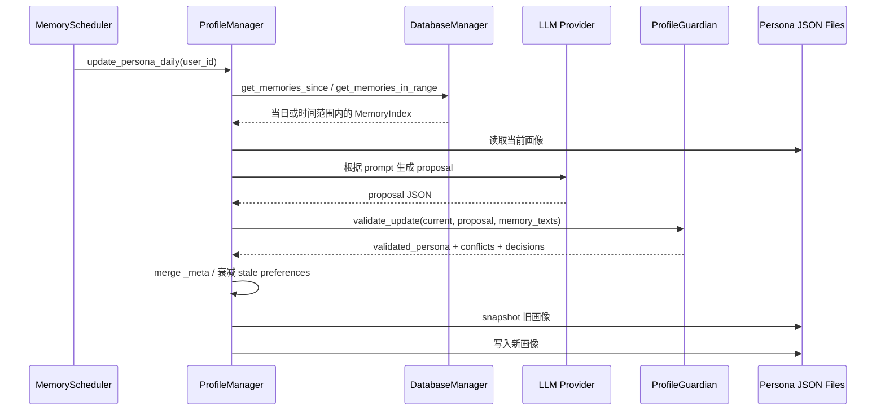

# astrbot_plugin_engram 画像系统设计文档

## 1. 文档目的

本文档用于说明 `astrbot_plugin_engram` 中“用户画像系统”的设计与实现，覆盖：

- 画像数据结构
- 画像生成与更新流程
- 防幻觉保护策略
- 证据链与快照回滚
- 画像渲染输出
- 与记忆系统、命令系统、群聊系统的关系

项目路径：`E:/AI/shouban/astrbot_plugin_engram`

---

## 2. 画像系统的角色定位

在本项目中，长期记忆与用户画像是两条并行但互补的能力：

- **长期记忆**：保存具体事件、具体原话、可回溯上下文
- **用户画像**：保存相对稳定的结构化“人设档案”

可以把二者理解为：

| 能力 | 回答的问题 |
|---|---|
| 长期记忆 | “之前发生过什么？” |
| 用户画像 | “这个人通常是什么样？” |

因此，画像系统并不是简单的“标签池”，而是 LLM 个性化回复的上层抽象。

---

## 3. 总体架构

## 3.1 核心模块

画像系统主要由以下模块构成：

- `core/profile_manager.py`：画像存储、读取、更新、回滚核心
- `services/profile_guardian.py`：画像更新防护器，负责拦截幻觉与冲突
- `profile_renderer.py`：将画像渲染为图片
- `handlers/profile_commands.py`：画像命令入口
- `handlers/onebot_sync.py`：从 OneBot 同步基础资料

## 3.2 架构关系图

```mermaid
flowchart TD
    A[原始记忆 / 用户资料 / 手工命令] --> B[ProfileManager]
    B --> C[ProfileGuardian]
    C --> D[画像 JSON 文件]
    D --> E[LLM 注入]
    D --> F[ProfileRenderer]
    F --> G[/profile show 图片]
    D --> H[WebUI /api/profile]
```

---

## 4. 设计目标

画像系统当前主要服务以下目标：

1. **结构化建模**：把用户信息拆成稳定字段，而不是一坨自然语言
2. **增量更新**：每天根据新增记忆逐步修正，不要求一次到位
3. **防幻觉污染**：避免 LLM 单轮误判直接写坏画像
4. **可追溯**：通过 `_meta` 记录证据来源与更新时间
5. **可回滚**：发生错误更新时可以快速恢复旧版本
6. **可视化输出**：支持 `/profile show` 与 WebUI 渲染

---

## 5. 数据存储设计

## 5.1 存储位置

画像系统采用 JSON 文件存储，而不是 SQLite 表。

| 类型 | 路径 | 说明 |
|---|---|---|
| 当前画像 | `engram_personas/{user_id}.json` | 当前用户画像 |
| 历史快照 | `engram_personas/history/{user_id}.json` | 回滚用画像历史 |

## 5.2 选择 JSON 的原因

相较于关系型表，JSON 的优势是：

- 结构灵活，字段迭代成本低
- 适合嵌套字典 + 列表混合结构
- 对插件本地部署更轻量

代价是：

- 不利于复杂统计分析
- 不利于跨用户批量查询
- 不适合作为强约束结构化数据库

但对当前插件规模与目标来说，这是合理权衡。

---

## 6. 画像数据结构设计

`ProfileManager._build_default_profile()` 定义了默认画像结构。

## 6.1 顶层结构

```json
{
  "basic_info": {},
  "attributes": {},
  "preferences": {},
  "social_graph": {},
  "dev_metadata": {},
  "shared_secrets": false,
  "pending_proposals": [],
  "_meta": {}
}
```

## 6.2 字段分层说明

### 6.2.1 `basic_info`

保存身份基础信息：

- `qq_id`
- `nickname`
- `gender`
- `age`
- `location`
- `job`
- `avatar_url`
- `birthday`
- `constellation`
- `zodiac`
- `signature`

特点：

- 这部分字段更偏“客观事实”
- 部分字段受强证据保护
- 部分字段由 OneBot 资料同步直接补充

### 6.2.2 `attributes`

保存用户特征：

- `personality_tags`
- `hobbies`
- `skills`

特点：

- 这部分最容易被 LLM“合理猜错”
- 因此启用了“置信度提案晋升机制”

### 6.2.3 `preferences`

保存偏好与禁忌：

- `favorite_foods`
- `favorite_items`
- `favorite_activities`
- `likes`
- `dislikes`

特点：

- 更偏长期个性化信息
- 会做冲突检测
- `likes/dislikes` 支持 TTL 衰减

### 6.2.4 `social_graph`

保存关系状态与互动统计：

- `relationship_status`
- `important_people`
- `interaction_stats`

其中 `interaction_stats` 包含：

- `first_chat_date`
- `last_chat_date`
- `total_chat_days`
- `total_valid_chats`

### 6.2.5 `dev_metadata`

偏开发者向信息：

- `os`
- `tech_stack`

### 6.2.6 `shared_secrets`

布尔值，用于表示用户是否与 Bot 分享过较深层的秘密/心事。

### 6.2.7 `pending_proposals`

画像更新中尚未转正的候选属性列表。

### 6.2.8 `_meta`

记录：

- `updated_at`
- `fields`

其中 `fields` 负责维护字段级证据链。

---

## 7. 默认画像与读取策略

## 7.1 默认画像

当某个用户还没有画像文件时，系统不会报错，而是返回一个完整默认结构。

## 7.2 自动补齐

即使用户已有画像文件，只要缺字段，`get_user_profile()` 也会自动补齐默认结构中缺失的顶层字段。

## 7.3 降级策略

若画像文件：

- 不存在 → 返回默认画像
- JSON 损坏 → 记录日志并回退默认画像
- 内容不是 dict → 直接回退默认画像

这一策略保证画像系统尽量“不阻塞主链路”。

---

## 8. 更新流程设计

画像更新大致分为三类来源：

1. **OneBot 同步的基础资料更新**
2. **每日基于长期记忆的深度更新**
3. **命令 / WebUI 手工更新**

## 8.1 通用更新能力

`ProfileManager.update_user_profile()` 提供统一增量 merge 能力：

- dict：递归 merge
- list：去重合并
- scalar：新值覆盖旧值

这意味着手工修改、资料同步、画像更新都可以共用这套落盘能力。

---

## 9. 每日画像更新流程

## 9.1 入口

主入口：`ProfileManager.update_persona_daily()`

它通常由 `MemoryScheduler.daily_persona_scheduler()` 在每日定时任务中触发。

## 9.2 时序图



## 9.3 输入来源

画像更新不是直接读取原始聊天，而是读取：

- `MemoryIndex` 中当日或指定时间范围的长期记忆摘要

这意味着画像更新已经建立在“记忆摘要层”之上，而不是完全原始对话层。

## 9.4 Prompt 构造

提示词模板来自：

- `persona_update_prompt`

注入变量：

- `{{current_persona}}`
- `{{memory_texts}}`

设计目的：

- 让 LLM 理解已有画像
- 让 LLM 只在新增证据基础上做补充和修正

---

## 10. 防幻觉保护设计

画像系统最核心的安全阀是：`ProfileGuardian`。

## 10.1 角色定位

`ProfileGuardian` 不是简单校验器，而是画像更新的“审核层”。

其职责包括：

- 基础字段保护
- 强证据检查
- 属性置信度晋升
- 偏好冲突检测
- pending proposal 管理
- 结构化决策结果输出

## 10.2 总体验证流程

主方法：`validate_update(current_profile, new_profile, memory_texts)`

输出三部分：

1. `validated`：最终可写入画像
2. `conflicts`：检测到的冲突项
3. `decisions`：接受 / 拒绝 / pending 的结构化决策信息

---

## 11. 基础字段保护

## 11.1 全保护字段

以下字段属于“系统保护字段”，一旦已有值，LLM 不允许直接覆盖：

- `qq_id`
- `nickname`
- `avatar_url`
- `signature`
- `birthday`
- `constellation`
- `zodiac`

## 11.2 强证据保护字段

以下字段允许变更，但必须命中强证据：

- `gender`
- `age`
- `location`
- `job`

## 11.3 强证据提取

通过 `STRONG_EVIDENCE_PATTERNS` 中的正则模式，从 `memory_texts` 中抽取明确陈述，例如：

- “我是男生”
- “我今年 24 岁”
- “我在上海工作”
- “我是程序员”

若没有命中强证据：

- 新值会被拦截
- 保留旧值
- 在 `decisions.reasons` 中记录拒绝原因

---

## 12. 属性置信度晋升机制

## 12.1 适用范围

适用于 `attributes` 中的：

- `personality_tags`
- `hobbies`
- `skills`

## 12.2 机制说明

当 LLM 第一次提出一个新属性时，不一定立刻写入正式画像，而是先写入 `pending_proposals`。

提案结构大致包含：

- `category`
- `value`
- `confidence`
- `first_seen`
- `last_seen`
- `layer`
- `reason`

## 12.3 晋升规则

若同一属性被多次重复提到，`confidence` 会递增；达到：

- `profile_confidence_threshold`

后，才会转正进入正式画像。

## 12.4 设计意义

这能有效降低以下问题：

- LLM 单轮误抽取
- 记忆摘要偶发噪声
- 短期事件被错误当成人格特征

---

## 13. 偏好冲突检测

## 13.1 适用范围

适用于 `preferences` 字段更新，特别是：

- `favorite_foods`
- `favorite_items`
- `favorite_activities`
- `likes`
- `dislikes`

## 13.2 冲突来源

`ProfileGuardian` 内置了 `CONFLICT_PAIRS`，例如：

- 喜欢 vs 讨厌
- 外向 vs 内向
- 严谨 vs 马虎
- 喜欢猫 vs 对猫过敏

## 13.3 处理策略

检测到冲突后：

- 不直接覆盖旧值
- 将冲突项放入 pending proposal
- 在 `conflicts` 与 `decisions.reasons` 中记录原因

这是一种保守策略：

**宁可暂缓，也不直接污染画像。**

---

## 14. 证据链元数据设计

## 14.1 `_meta.fields` 结构

每个字段路径可记录以下元数据：

- `last_seen_at`
- `evidence_count`
- `evidence_refs`

例如：

```json
{
  "preferences.likes.冰美式": {
    "last_seen_at": "2026-03-19T23:30:00",
    "evidence_count": 3,
    "evidence_refs": [
      "memory_index:a,b,c"
    ]
  }
}
```

## 14.2 证据引用来源

`ProfileManager._build_evidence_ref()` 会优先把近期参与更新的 `MemoryIndex.index_id` 拼成引用串，例如：

```text
memory_index:id1,id2,id3
```

如果没有可用记忆 ID，则回退为：

```text
persona_daily:2026-03-19
```

## 14.3 作用

证据链用于：

- `/profile evidence` 输出摘要
- 图片渲染附加证据信息
- 判断偏好 TTL 是否应衰减
- 后续审计与解释性展示

---

## 15. 偏好 TTL 衰减设计

## 15.1 适用字段

当前主要衰减：

- `preferences.likes`
- `preferences.dislikes`

## 15.2 衰减规则

若某个偏好项的 `_meta.fields[path].last_seen_at` 超过：

- `profile_preference_ttl_days`

且长期没有新证据支撑，则会被移除。

## 15.3 设计意义

这样可以避免：

- 很久以前的一次随口表达永久污染画像
- 旧偏好长期影响当下回复

---

## 16. 快照与回滚设计

## 16.1 快照机制

正式写入新画像前，系统会调用 `_snapshot_profile()` 保存当前画像到历史文件。

历史项结构：

```json
{
  "snapshot_at": "2026-03-19T00:01:20",
  "profile": { ... }
}
```

## 16.2 历史保留数量

由配置控制：

- `profile_history_limit`

默认保留最近 5 份。

## 16.3 回滚流程

入口：`rollback_user_profile(user_id, steps=1)`

逻辑：

1. 读取历史列表
2. 取倒数第 `steps` 个快照
3. 覆盖当前画像文件
4. 删除已消费的历史项

## 16.4 设计价值

当发生：

- LLM 误更新
- 手工误修改
- 外部同步写错字段

时，管理员可以较低成本恢复到旧版本。

---

## 17. 互动统计设计

## 17.1 更新时机

在一次成功回复后，由：

- `ProfileManager.update_interaction_stats(user_id)`

更新用户互动统计。

## 17.2 维护字段

- `first_chat_date`
- `last_chat_date`
- `total_chat_days`
- `total_valid_chats`

## 17.3 设计意义

这部分数据既用于画像本身，也为“羁绊等级”计算提供基础支撑。

---

## 18. OneBot 同步资料设计

## 18.1 模块位置

- `handlers/onebot_sync.py`

## 18.2 作用

把平台可直接拿到的用户资料补进画像，例如：

- 头像 URL
- 生日
- 性别
- 年龄
- 地区
- 个性签名
- 职业等

## 18.3 与画像更新的关系

OneBot 同步属于“外部事实输入”，它与 LLM 推断型画像更新并行存在。

它的优点是：

- 成本低
- 一般更可靠
- 可补齐很多 LLM 无法稳定推断的信息

---

## 19. 画像注入设计

## 19.1 注入入口

在 `on_llm_request` 中，插件会先读取：

- `logic.get_user_profile(user_id)`

再交给：

- `LLMContextInjector.build_profile_block(profile)`

## 19.2 注入优先级

项目当前整体思路是：

- 用户画像
- 长期记忆
- 当前轮上下文

共同构成最终 prompt。

## 19.3 设计价值

画像能提供：

- 稳定偏好
- 长期人格标签
- 社交关系状态
- 开发者/职业背景信息

这些信息未必来自最新一轮记忆，但对个性化回答非常重要。

---

## 20. 群聊中的画像策略

当前群聊系统没有独立群画像，而是：

- 在群聊回复时仍读取发言人的私聊画像

这意味着群聊中的个性化基础仍然来自：

- `engram_personas/{sender_id}.json`

优点：

- 不用重复维护群画像体系
- 群聊也能受益于私聊画像积累

限制：

- 没有群级画像
- 无法表达“这个人在某个群里的特殊身份”

---

## 21. 图片渲染设计

## 21.1 模块定位

`profile_renderer.py` 负责把结构化画像转换成手账风格图片。

## 21.2 核心能力

- 自动查找可用字体
- 下载并缓存头像
- 动态计算画布高度
- 按类别展示标签
- 结合 `BondCalculator` 显示羁绊等级
- 可选附加证据摘要

## 21.3 标签分类映射

渲染时会把画像中的字段映射为可展示标签，例如：

- 性格 → `personality_tags`
- 爱好 → `hobbies`
- 美食 → `favorite_foods`
- 心头好 → `favorite_items`
- 休闲 → `favorite_activities`
- 禁忌 → `dislikes`

若新字段为空但旧版 `likes` 有值，也会做兼容展示。

## 21.4 羁绊系统

渲染器内部通过 `BondCalculator` 计算：

- 羁绊等级
- 进度值
- 成就
- 提示语

这使得画像不仅是静态档案，也带有“陪伴关系”的表现层。

## 21.5 证据摘要展示

如果开启：

- `show_profile_evidence_in_image = true`

渲染器会把证据摘要附加到图片底部。

---

## 22. 命令与 WebUI 接口

## 22.1 命令系统

画像相关命令主要由 `handlers/profile_commands.py` 处理，包括：

- `/profile show`
- `/profile set`
- `/profile rollback`
- `/profile evidence`
- `/profile delete`
- `/profile clear`

## 22.2 WebUI

WebUI 提供：

- `GET /api/profile/{user_id}`
- `GET /api/profile/{user_id}/render`
- `POST /api/profile/{user_id}`
- `POST /api/profile/{user_id}/remove-item`
- `DELETE /api/profile/{user_id}`

这使画像系统同时具备：

- 聊天指令入口
- 浏览器管理入口

---

## 23. 优点与局限

## 23.1 优点

### 23.1.1 结构化程度高

不是单纯用 prompt 文本拼接，而是维护明确字段结构。

### 23.1.2 安全防护较完整

有强证据保护、置信度晋升、冲突检测三道防线。

### 23.1.3 具有解释性

通过 `_meta` 可以追踪字段证据与更新时间。

### 23.1.4 可回滚

画像误更新后可恢复，维护体验较好。

### 23.1.5 输出形式友好

既能用于 prompt 注入，也能渲染成可读图片。

## 23.2 局限

### 23.2.1 仍依赖 LLM 提取质量

即便有防护，画像质量上限仍受记忆摘要与模型表现影响。

### 23.2.2 JSON 不适合大规模分析

跨用户画像统计与检索能力有限。

### 23.2.3 群聊画像尚未独立

群聊仍复用私聊画像，没有真正的群场景人格层。

### 23.2.4 证据粒度仍偏摘要级

当前证据更多来自 `MemoryIndex`，并非精确到每句原文。

---

## 24. 后续演进建议

## 24.1 画像字段更细化

可考虑增加：

- 作息习惯
- 学业状态
- 情绪模式
- 常用表达风格

## 24.2 证据精度提升

可让 `_meta` 同时关联：

- `MemoryIndex.index_id`
- `RawMemory.uuid`

从而提供更精确原文证据链。

## 24.3 群场景画像扩展

可新增：

- 群内角色
- 群内关系网络
- 群内常见话题定位

## 24.4 画像入库

若后续需要更复杂的批量分析，可将 JSON 逐步迁移为 SQLite 结构化表。

---

## 25. 一句话总结

`astrbot_plugin_engram` 的画像系统本质上是：

**基于长期记忆摘要持续增量构建的结构化用户档案，并通过防幻觉审核、证据链、快照回滚和图片渲染，把“记住一个人”从检索能力升级为人格化能力。**
