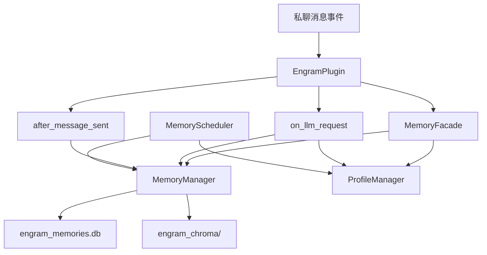
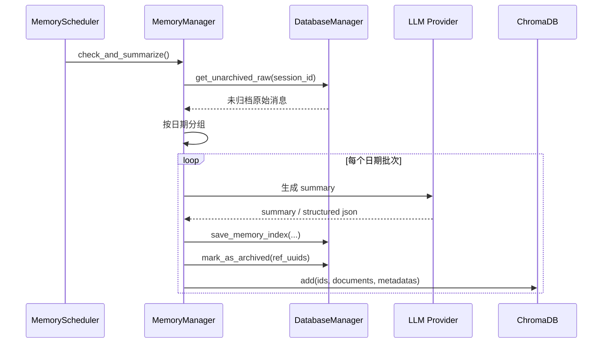

# astrbot_plugin_engram 私聊记忆设计文档

## 1. 文档目的

本文档专门说明 `astrbot_plugin_engram` 的**私聊记忆系统**设计，重点回答以下问题：

- 私聊消息如何进入记忆系统
- 长期记忆如何归档、检索与回溯原文
- 私聊记忆与用户画像如何联动
- 删除、撤销、导出、降级策略如何实现
- 私聊记忆与群聊记忆在边界上如何区分

项目路径：`E:/AI/shouban/astrbot_plugin_engram`

---

## 2. 设计背景

LLM 在即时通讯场景中的典型问题包括：

- 会话窗口有限，长程信息容易丢失
- 用户偏好、关系状态、历史事件无法稳定持续
- 模型容易“知道曾经说过什么”，却无法回溯到原句证据
- 单纯依赖当前上下文时，回复连续性和人格一致性较差

因此，本项目为私聊场景设计了一套**以原始消息为事实源、以长期摘要为检索核心、以用户画像为高层抽象**的记忆体系。

---

## 3. 设计目标

私聊记忆系统主要服务以下目标：

1. **完整留痕**：先保存原始问答，再异步沉淀长期记忆
2. **可回溯**：每条长期记忆都能定位回原始对话
3. **低侵入**：不阻塞主聊天链路，归档与维护放到后台执行
4. **可检索**：支持向量语义召回与 SQLite FTS5 BM25 关键词降级检索（失败再回退 LIKE）
5. **可维护**：支持删除、撤销、导出、向量重建
6. **可联动**：与画像系统共同构成长期人格与事实记忆层

---

## 4. 总体架构

## 4.1 组件结构

私聊记忆系统由以下核心模块组成：

- `main.py`：私聊事件入口与路由
- `MemoryFacade`：统一门面，协调记忆与画像
- `MemoryManager`：原始消息、归档、检索、删除、导出核心
- `DatabaseManager`：SQLite 持久化层
- `MemoryScheduler`：后台归档、维护、折叠任务
- `IntentClassifier`：决定是否触发长期记忆检索
- `LLMContextInjector`：将画像与记忆注入到 prompt
- `ProfileManager`：用户画像读写与每日更新

## 4.2 架构图

---

## 5. 存储设计

## 5.1 物理存储路径

私聊记忆使用以下存储：

| 类型 | 路径 | 说明 |
|---|---|---|
| SQLite | `engram_memories.db` | 原始消息与长期记忆索引 |
| ChromaDB | `engram_chroma/` | 长期记忆向量索引 |
| JSON | `engram_personas/{user_id}.json` | 当前用户画像 |
| JSON | `engram_personas/history/{user_id}.json` | 画像快照历史 |

## 5.2 核心表

私聊数据库复用两张核心表：

- `RawMemory`
- `MemoryIndex`

### `RawMemory`

记录进入记忆系统的原始消息：

- `uuid`
- `session_id`
- `user_id`
- `user_name`
- `role`
- `content`
- `msg_type`
- `is_archived`
- `timestamp`

### `MemoryIndex`

记录归档后的长期记忆：

- `index_id`
- `summary`
- `ref_uuids`
- `prev_index_id`
- `source_type`
- `user_id`
- `active_score`
- `created_at`

---

## 6. 私聊消息录入设计

## 6.1 入口

对应方法：`main.py` → `on_private_message`

流程：

1. 获取 `user_id`、消息内容、昵称
2. 判断是否为命令消息
3. 若不是命令，则调用 `logic.record_message(...)`
4. 同时触发 `OneBotSyncHandler.sync_user_info()` 同步基础资料

## 6.2 录入条件

一条私聊消息要进入私聊记忆系统，需要满足：

1. 不是指令消息
2. 内容通过 `_is_valid_message_content()` 过滤
3. 文本不是无意义短消息或内部控制消息

## 6.3 用户回复后补全双边对话

对应方法：`main.py` → `after_message_sent`

当 assistant 真正完成回复后：

- assistant 回复也会写入 `RawMemory`
- 画像互动统计会更新

这样私聊记忆保存的是**完整的一问一答闭环**，而不是只有用户输入。

---

## 7. 长期记忆归档设计

## 7.1 归档原则

私聊长期记忆不是实时生成，而是后台异步归档。

对应方法：`MemoryManager.check_and_summarize()`

## 7.2 触发条件

典型触发条件：

- 距最后一条用户消息超过 `private_memory_timeout`
- 未归档消息数达到 `min_msg_count`

## 7.3 归档流程

## 7.4 关键设计点

### 7.4.1 按天分组总结

这样可以：

- 控制单次总结上下文长度
- 让记忆时间粒度更清晰
- 避免跨日事件混杂

### 7.4.2 先写 SQLite，再写向量

即使向量写入失败：

- `MemoryIndex` 仍然保留
- 原始消息仍被归档
- 后续可执行向量补偿或重建

### 7.4.3 时间链

通过 `prev_index_id` 把记忆组织成时间链，支持“前情提要”检索增强。

---

## 8. 私聊检索设计

## 8.1 触发入口

对应方法：`main.py` → `on_llm_request`

流程：

1. 读取当前用户画像
2. 使用 `IntentClassifier.should_retrieve_memory(query)` 判断是否值得检索
3. 若需要，则调用 `logic.retrieve_memories(user_id, query)`
4. 结果由 `LLMContextInjector` 注入 prompt

## 8.2 检索链路

默认检索链路为：

1. Chroma 向量召回候选
2. SQLite 回查 `MemoryIndex`
3. 批量回查 `RawMemory`
4. 拼装结构化回溯文本
5. 更新命中记忆的 `active_score`

## 8.3 检索分类

`IntentClassifier` 会粗分为：

- `skip`
- `recall`
- `preference_fact`
- `event_narrative`

这些分类会影响：

- 是否检索
- 相似度阈值
- 关键词/向量/时效权重

## 8.4 降级策略

当以下情况发生时：

- 未安装 `chromadb`
- embedding provider 不可用
- Chroma 查询失败
- 向量维度不匹配

系统会自动回退到 SQLite FTS5 BM25 关键词检索（失败时再回退 LIKE）。

这保证了私聊记忆在受限环境下仍可用。

---

## 9. 画像联动设计

私聊记忆与画像系统是并行协作而不是互相替代的关系。

## 9.1 对话前联动

在 `on_llm_request` 中：

- 画像块提供稳定人格与长期偏好
- 记忆块提供具体事件、事实与历史对白

## 9.2 每日更新联动

`ProfileManager.update_persona_daily()` 会读取一段时间范围内的 `MemoryIndex`，基于长期记忆更新画像。

这意味着：

- 原始消息 → 长期记忆 → 用户画像

形成三层抽象链路。

## 9.3 边界说明

私聊记忆系统：

- 关注“发生过什么、说过什么”
- 重点是事件与原文证据

画像系统：

- 关注“这个人是什么样的人”
- 重点是稳定偏好、属性、关系与统计

---

## 10. 删除与撤销设计

## 10.1 删除能力

支持：

- 仅删除长期记忆索引
- 删除长期记忆索引 + 原始消息
- 删除 Chroma 对应向量

## 10.2 撤销能力

对应方法：`MemoryManager.undo_last_delete()`

支持恢复：

- `MemoryIndex`
- Chroma 向量数据
- `RawMemory.is_archived` 状态

## 10.3 限制

撤销历史已持久化到 SQLite `deletehistory`：

- 每个作用域默认保留最近 3 次
- 插件重启后仍可使用 `/mem_undo` 恢复

---

## 11. 导出设计

私聊导出以 `RawMemory` 为源，支持：

- `jsonl`
- `json`
- `txt`
- `alpaca`
- `sharegpt`

对应方法：

- `MemoryManager.export_raw_messages()`
- `MemoryManager.export_all_users_messages()`

适用场景：

- 审查聊天数据
- 制作微调语料
- 统计与备份

---

## 12. 调度设计

私聊后台调度由 `MemoryScheduler` 负责。

主要任务包括：

- `background_worker()`：归档检测
- `daily_persona_scheduler()`：每日画像更新
- `daily_memory_maintenance()`：活跃度衰减与冷记忆清理
- `weekly/monthly/yearly_folding_scheduler()`：折叠总结

这说明私聊记忆系统不仅支持日常摘要，还支持更高层级的周/月/年折叠。

---

## 13. 与群聊记忆的区别

| 维度 | 私聊记忆 | 群聊记忆 |
|---|---|---|
| 主体 | `user_id` | `group_id` 或 `user_id`（可配置） |
| 初始化 | 启动时即初始化 | 按需延迟初始化 |
| 数据库 | `engram_memories.db` | `engram_memories_group.db` |
| 向量库 | `engram_chroma/` | `engram_chroma_group/` |
| 画像 | 完整联动 | 主要复用私聊画像 |
| 归档时间 | `private_memory_timeout` | 优先 `group_memory_timeout`，未配置回退私聊 |
| 最少消息数 | `min_msg_count` | 优先 `group_min_msg_count`，未配置回退私聊 |
| 折叠总结 | 支持周/月/年 | 当前默认关闭月/年折叠 |
| WebUI | 完整支持 | 新增独立群聊记忆页面 |

---

## 14. 优点与局限

## 14.1 优点

1. **原始消息可追溯**：摘要不是黑盒，可回溯原句
2. **检索链路稳定**：向量优先、关键词兜底
3. **与画像协同**：事件与人格两条线并行增强
4. **运维友好**：支持删除、撤销、导出、重建
5. **插件部署简单**：仅依赖本地 SQLite/JSON，可选 Chroma

## 14.2 局限

1. **不是每条消息都立即成为长期记忆**：需要等待归档条件满足
2. **向量能力依赖环境**：无 `chromadb` 时走 SQLite FTS5 BM25 关键词检索（失败再回退 LIKE）
3. **画像更新仍依赖 LLM 输出质量**：虽然有 guardian 防护，但不是绝对零误差

---

## 15. 后续演进建议

1. 补充独立的“私聊记忆 WebUI 设计文档”，与当前实现保持完全映射
2. 在已持久化删除/撤销基础上补充更细粒度审计能力（操作者、来源、恢复链路）
3. 为向量补偿任务增加持久化队列表
4. 在 WebUI 中增强来源类型筛选与折叠总结浏览能力
5. 增加跨时间范围的私聊统计与记忆质量分析

---

## 16. 一句话总结

`astrbot_plugin_engram` 的私聊记忆设计本质上是：

**先完整保存私聊原始对话，再通过后台异步沉淀为可检索、可回溯、可与画像联动的长期记忆系统。**
