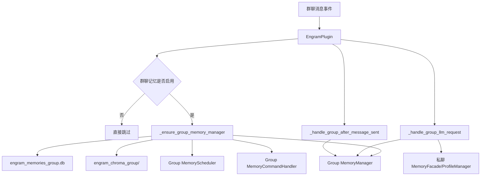
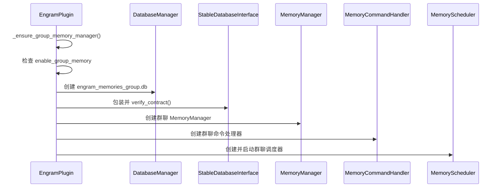
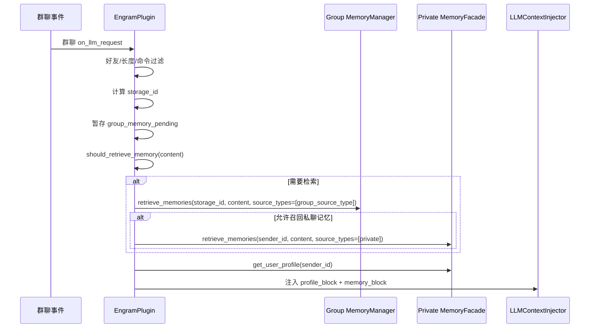
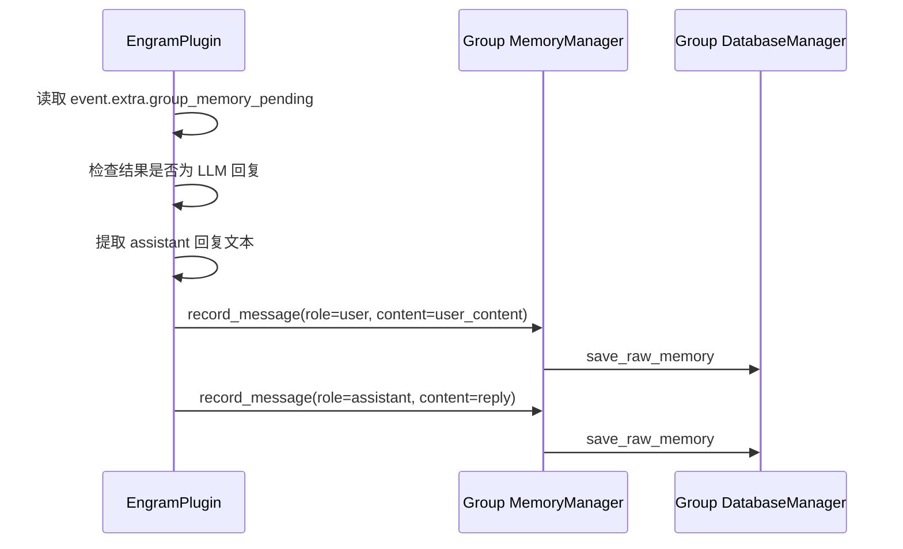

# astrbot_plugin_engram 群聊记忆设计文档

## 1. 文档目的

本文档专门说明 `astrbot_plugin_engram` 的**群聊记忆系统**设计，重点回答以下问题：

- 群聊记忆与私聊记忆在架构上如何隔离
- 群聊消息在什么条件下会被记录
- 群聊记忆是按“群”还是按“人”归属
- 群聊检索时如何与私聊记忆联动
- 群聊命令、调度、存储、权限与限制分别如何实现

项目路径：`E:/AI/shouban/astrbot_plugin_engram`

---

## 2. 设计背景

私聊场景中，记忆主体天然是“某个用户”；但群聊场景更复杂：

- 一条消息来自某个发言者
- 发生在某个群中
- 回复时既可能需要“本群上下文”，也可能需要“该成员的私人偏好”
- 不同 Bot 使用者对隐私边界的接受程度不同

因此，本项目没有直接复用私聊记忆，而是设计了**独立的群聊记忆子系统**，并通过配置控制隔离粒度与召回边界。

---

## 3. 设计目标

群聊记忆系统当前主要服务以下目标：

1. **隔离存储**：群聊数据与私聊数据分库、分向量目录，避免互相污染
2. **按需启用**：默认关闭，只有明确开启才生效
3. **低噪声采集**：通过最小字数、命令过滤、好友白名单等规则减少垃圾数据
4. **可配置归属**：支持按群或按人归档群聊记忆
5. **可控联动**：支持在群聊中可选召回私聊记忆，但默认关闭
6. **复用主能力**：尽量复用 `MemoryManager`、`MemoryScheduler`、`MemoryCommandHandler`，降低维护成本

---

## 4. 总体架构

## 4.1 组件结构

群聊记忆不是单独的一套完全新代码，而是在 `main.py` 中动态组装出来的子系统。

核心组件包括：

- `EngramPlugin._ensure_group_memory_manager()`：延迟初始化入口
- `DatabaseManager`：群聊 SQLite 数据库
- `StableDatabaseInterface`：数据库契约校验
- `MemoryManager`：群聊记忆核心管理器
- `MemoryScheduler`：群聊调度器
- `MemoryCommandHandler`：群聊命令处理器
- `FriendCacheService`：好友白名单辅助

## 4.2 架构图



---

## 5. 初始化设计

## 5.1 延迟初始化原则

群聊记忆不会在插件启动时默认初始化，而是采用**首次需要时再创建**的策略。

触发初始化的典型场景：

- 第一次群聊 LLM 请求前注入
- 第一次调用群聊记忆命令
- WebUI 需要统计群聊数据库时

## 5.2 初始化流程

对应方法：`main.py` → `_ensure_group_memory_manager()`

时序如下：



## 5.3 初始化结果

初始化完成后，插件内部会持有：

- `self._group_db`
- `self._group_memory_manager`
- `self._group_mem_handler`
- `self._group_scheduler`

这些对象均只服务群聊链路。

---

## 6. 存储设计

## 6.1 物理存储路径

群聊记忆使用独立存储：

| 类型 | 路径 | 说明 |
|---|---|---|
| SQLite | `engram_memories_group.db` | 群聊原始消息与长期记忆索引 |
| ChromaDB | `engram_chroma_group/` | 群聊长期记忆向量索引 |

## 6.2 与私聊存储的关系

| 场景 | 私聊 | 群聊 |
|---|---|---|
| SQLite 文件 | `engram_memories.db` | `engram_memories_group.db` |
| Chroma 路径 | `engram_chroma/` | `engram_chroma_group/` |
| 画像 | `engram_personas/{user_id}.json` | 仍复用私聊画像 |
| 命令处理器 | `_mem_handler` | `_group_mem_handler` |

## 6.3 复用的表结构

群聊数据库仍然使用与私聊完全一致的两张表：

- `RawMemory`
- `MemoryIndex`

区别不在 schema，而在：

- 数据库存放位置不同
- `user_id` / `session_id` 含义不同
- `source_type` 默认值不同

---

## 7. 核心配置项设计

群聊记忆相关配置位于 `_conf_schema.json` 的 `group_memory` 分组。

## 7.1 配置项一览

| 配置项 | 默认值 | 作用 |
|---|---:|---|
| `enable_group_memory` | `false` | 是否启用群聊记忆 |
| `group_memory_only_friends` | `true` | 是否仅记录好友的群聊消息 |
| `group_memory_min_text_length` | `6` | 群聊消息最小长度过滤 |
| `group_memory_source_type` | `group` | 群聊记忆的默认 `source_type` |
| `group_memory_store_session_as` | `group_id` | 群聊记忆归属绑定方式 |
| `group_memory_private_session_only` | `false` | 是否强制按用户隔离群聊记忆 |
| `group_memory_allow_private_recall` | `false` | 是否允许群聊检索时额外召回私聊记忆 |

## 7.2 配置意图说明

### 7.2.1 `enable_group_memory`

总开关。关闭时：

- 群聊记忆不会初始化
- 群聊请求前不注入记忆
- 群聊回复后不记录原始消息
- 群聊命令不可用

### 7.2.2 `group_memory_only_friends`

用于控制白名单边界。

- `true`：仅记录已加好友成员的消息
- `false`：任何群成员都可进入记忆流程

依赖 `FriendCacheService` 与 OneBot 好友列表。

### 7.2.3 `group_memory_min_text_length`

防止：

- “嗯”“哦”“6”“好”之类超短噪声
- 无实际记忆价值的口头填充

### 7.2.4 `group_memory_source_type`

用于标记群聊记忆来源，例如：

- `group`
- `group_private`
- `guild`

该值会进入：

- SQLite `MemoryIndex.source_type`
- Chroma metadata `source_type`
- 检索过滤条件

### 7.2.5 `group_memory_store_session_as`

决定群聊默认按什么维度归档：

- `group_id`：按群聚合，适合保留群公共上下文
- `user_id`：按发言人聚合，适合保留个人在群内表达轨迹

### 7.2.6 `group_memory_private_session_only`

若开启，则直接强制使用 `sender_id` 作为存储主体，相当于“群聊里只给每个成员记自己的账”。

优先级高于 `group_memory_store_session_as`。

### 7.2.7 `group_memory_allow_private_recall`

若开启，群聊检索时会在群记忆之外，额外检索该用户的私聊记忆，并在注入文本中打上 `【私聊】` 标签。

默认关闭，原因是它触及更强的隐私边界。

---

## 8. 记忆归属模型

群聊设计中最重要的问题之一，是“群聊记忆到底归谁”。

## 8.1 `storage_id` 概念

项目用 `storage_id` 统一表示群聊记忆的实际归属键。

对应方法：`_resolve_group_storage_id(group_id, sender_id)`

## 8.2 归属决策规则

规则如下：

1. 如果 `group_memory_private_session_only = true`
   - `storage_id = sender_id`
2. 否则读取 `group_memory_store_session_as`
   - 若为 `user_id`，则 `storage_id = sender_id`
   - 否则默认 `storage_id = group_id`

## 8.3 三种典型模式

### 模式 A：按群聚合（推荐默认）

配置：

```json
{
  "group_memory_store_session_as": "group_id",
  "group_memory_private_session_only": false
}
```

效果：

- 同一群的记忆聚合到一起
- 适合保留群聊公共梗、项目讨论、群体事件
- 缺点是不同成员信息会混在一个记忆体里

### 模式 B：按人聚合

配置：

```json
{
  "group_memory_store_session_as": "user_id",
  "group_memory_private_session_only": false
}
```

效果：

- 每个成员在群内的发言各自独立沉淀
- 更适合“群里也想记住这个人的习惯和信息”
- 对群整体上下文保持较弱

### 模式 C：强制私有隔离

配置：

```json
{
  "group_memory_private_session_only": true
}
```

效果：

- 无论其他配置如何，都按 `sender_id` 隔离
- 更偏隐私友好
- 与“按人聚合”类似，但表达的策略意图更明确

---

## 9. 群聊消息录入条件

群聊消息并不是每条都记。当前主链路会在 `_handle_group_llm_request()` 中先做筛选。

## 9.1 过滤规则

一条群消息要进入群聊记忆流程，需要同时满足：

1. `enable_group_memory = true`
2. 好友白名单通过（若开启）
3. 不是命令消息
4. 文本长度达到 `group_memory_min_text_length`
5. 本次确实触发了 LLM 请求链路

## 9.2 关键设计点

### 9.2.1 只在 LLM 触发链路记录

群聊消息不是见到就记，而是：

- 在 `on_llm_request` 群聊分支中先缓存待记录信息
- 等 `after_message_sent` 确认产生了真实 LLM 回复后
- 再把“用户消息 + assistant 回复”一起写入群聊原始表

这意味着：

- 没有触发 LLM 的群消息通常不会进入群聊记忆
- 记忆只保留“真正发生了回复闭环”的交互

### 9.2.2 先暂存，再落库

在请求前阶段，插件会将如下信息存入 `event.extra["group_memory_pending"]`：

- `storage_id`
- `group_id`
- `sender_id`
- `user_name`
- `content`
- `source_type`

等到回复成功后再正式写库。

---

## 10. 群聊注入流程设计

## 10.1 主流程

对应方法：`_handle_group_llm_request()`



## 10.2 注入内容构成

群聊最终注入给 LLM 的上下文由三部分组成：

1. **画像块**：来自私聊画像 `get_user_profile(sender_id)`
2. **群聊记忆块**：来自群聊数据库检索结果
3. **工具提示块**：证据不足时提示模型可继续调用工具

## 10.3 私聊召回联动

如果开启 `group_memory_allow_private_recall`：

- 先查群聊记忆
- 再查当前发言人的私聊记忆
- 最终合并结果并去重
- 注入时会添加标签：
  - `【群聊】...`
  - `【私聊】...`

这样模型可以区分来源，避免误把私人信息当作群公共事实。

---

## 11. 群聊回复后写入设计

对应方法：`_handle_group_after_message_sent()`

## 11.1 写入流程



## 11.2 用户名存储策略

群聊用户消息写入时，`user_name` 并不是单纯昵称，而是：

```text
{sender_name}({sender_id})
```

这样做的目的：

- 回放原文时更容易识别是谁说的
- 即使群昵称变动，也能保留 ID 痕迹

---

## 12. 归档与调度设计

群聊记忆同样有后台调度器，但与私聊调度器存在差异。

## 12.1 复用能力

群聊调度器仍然使用：

- `MemoryScheduler`
- `MemoryManager.check_and_summarize()`

因此它具备：

- 原始消息归档
- 长期记忆生成
- 向量写入
- 冷热度维护

## 12.2 被关闭的能力

创建群聊调度器时，代码显式关闭：

- `enable_memory_folding = False`
- `enable_monthly_folding = False`
- `enable_yearly_folding = False`

## 12.3 设计原因

这说明当前群聊记忆**不做周/月/年折叠总结**，主要原因可能包括：

1. 群聊本身噪声更高，过度折叠价值有限
2. 群记忆主体可能是群，也可能是人，折叠语义容易混乱
3. 先保证群聊日常检索与管理稳定，再考虑更高阶汇总

---

## 13. 群聊命令设计

群聊命令本质上复用了 `MemoryCommandHandler`，只是换成群聊专用 `storage_id` 与群聊数据库。

## 13.1 命令列表

| 命令 | 说明 |
|---|---|
| `/group_mem_list [数量]` | 查看本群最近记忆 |
| `/group_mem_view <序号或ID>` | 查看本群记忆详情 |
| `/group_mem_search <关键词>` | 搜索本群长期记忆 |
| `/group_mem_delete <序号或ID>` | 删除本群总结记忆 |
| `/group_mem_delete_all <序号或ID>` | 删除本群总结记忆及原始消息 |
| `/group_mem_undo` | 撤销本群最近一次删除 |
| `/group_mem_force_summarize` | 管理员强制归档本群未处理对话 |

## 13.2 命令复用方式

群聊命令执行步骤通常是：

1. 检查当前是否处于群聊
2. 获取 `_group_mem_handler`
3. 用 `_resolve_group_storage_id()` 计算 `storage_id`
4. 调用 `handle_mem_list / handle_mem_view / handle_mem_delete ...`
5. 用 `_rewrite_group_command_hints()` 把提示文案中的 `/mem_*` 替换成 `/group_mem_*`

## 13.3 设计价值

这样实现的好处是：

- 私聊与群聊指令体验保持一致
- 不需要维护两套文案与删除逻辑
- 未来命令增强可以同步受益

---

## 14. 好友白名单设计

## 14.1 判断逻辑

对应方法：`_group_memory_friend_allowed(event)`

逻辑如下：

- 若 `group_memory_only_friends = false`，直接允许
- 否则调用 `FriendCacheService.is_friend(sender_id, bot=bot)`

## 14.2 数据来源

好友缓存由 `FriendCacheService` 维护，并可通过：

- 按需刷新好友列表
- OneBot `friend_add` 通知增量更新

## 14.3 设计意图

默认只记录好友消息，是一种更保守的隐私边界：

- 降低陌生成员信息被长期沉淀的概率
- 减少大群场景下的噪声
- 更适合“Bot 服务熟人群”场景

---

## 15. 群聊与私聊联动边界

## 15.1 当前联动方式

群聊系统目前与私聊系统的联动主要有两个：

### 15.1.1 画像联动

在群聊中，插件仍然会读取：

- `self.logic.get_user_profile(sender_id)`

也就是说，群聊回复时的“人物画像”来自私聊画像系统，而不是独立群画像。

### 15.1.2 私聊记忆可选召回

开启 `group_memory_allow_private_recall` 后，群聊检索时可额外查：

- `self.logic.retrieve_memories(sender_id, content, source_types=["private"])`

## 15.2 当前没有做的事

群聊系统当前**没有**：

- 独立的群画像文件
- 群成员关系图谱
- 群级共享画像
- 群聊版 persona daily
- 自动把群聊信息同步进私聊数据库

这说明当前设计仍然是：

**群聊有独立记忆，但人物画像仍以私聊档案为主。**

---

## 16. 群聊检索策略

## 16.1 默认检索范围

群聊检索默认只查：

- 当前群聊数据库
- 且 `source_type = group_memory_source_type`

## 16.2 开启私聊联动后的检索范围

如果 `group_memory_allow_private_recall = true`：

- 先查群聊数据库中 `source_type = group_memory_source_type`
- 再查私聊数据库中 `source_type = private`
- 最后合并返回

## 16.3 话题缓存

群聊检索同样使用话题缓存，但缓存键基于：

- `storage_id`
- 当前 query

如果允许私聊召回，则代码会避免直接沿用缓存命中结果，以免混淆群聊与私聊的混合召回结果。

---

## 17. 群聊删除与撤销设计

群聊删除、撤销完全复用 `MemoryManager` 能力，只是作用对象换成群聊数据库与群聊向量库。

## 17.1 删除能力

支持：

- 仅删除 `MemoryIndex`
- 删除 `MemoryIndex + RawMemory`
- 删除 Chroma 对应向量
- 记录 `_delete_history`

## 17.2 撤销能力

支持恢复：

- SQLite 记忆索引
- Chroma 向量数据
- 原始消息归档状态

## 17.3 注意事项

撤销历史仍是**内存态**，因此：

- 仅当前运行周期有效
- 插件重启后会丢失
- 群聊与私聊各自由各自的 `MemoryManager` 管理各自历史

---

## 18. WebUI 对群聊的支持

虽然 WebUI 没有单独的“群聊记忆页面”，但已经具备部分群聊支撑能力：

1. `stats/overview` 会尝试读取群聊数据库统计
2. Dashboard 可展示群聊数据库路径与统计信息
3. 群聊数据库仅在实际启用并初始化后才参与统计

当前限制是：

- WebUI 主记忆页主要仍围绕主数据库操作
- 没有专门按群维度浏览群记忆的独立页面

---

## 19. 优点与局限

## 19.1 优点

### 19.1.1 架构隔离清晰

群聊与私聊分库分向量目录，风险边界更清楚。

### 19.1.2 复用成熟能力

大量复用 `MemoryManager` / `MemoryScheduler` / `MemoryCommandHandler`，降低了实现成本。

### 19.1.3 归属策略灵活

支持按群、按人、强隔离三种模式，适配不同使用偏好。

### 19.1.4 隐私边界可控

通过好友白名单、私聊联动开关等配置，提供更细的控制粒度。

## 19.2 局限

### 19.2.1 只记录触发 LLM 的群消息

没有触发回复的群消息通常不会入库，因此群聊记忆不是完整聊天日志。

### 19.2.2 缺少群画像

当前只有“群聊记忆 + 私聊画像”，没有真正的“群人格档案”或“群共识画像”。

### 19.2.3 无高级折叠总结

群聊目前关闭了周/月/年折叠，不适合做长期高层摘要分析。

### 19.2.4 WebUI 支持仍偏基础

群聊浏览与维护能力尚未像私聊那样完整可视化。

---

## 20. 后续演进建议

## 20.1 群级画像

可新增：

- 群主题标签
- 群常驻成员画像
- 群共享禁忌/习惯
- 群近期热点摘要

## 20.2 群记忆浏览页

WebUI 可补充：

- 按群筛选
- 按 storage_id 浏览
- 群公共记忆 / 个人群记忆切换

## 20.3 更细粒度权限控制

例如：

- 仅管理员可查看/删除群长期记忆
- 区分群公共记忆与个人群记忆的可见范围

## 20.4 群聊事件型摘要

可考虑把群聊更偏“公共事件”的内容抽成独立 `source_type`，例如：

- `group_event`
- `group_topic`
- `group_member_fact`

这样有利于检索与摘要策略分化。

---

## 21. 一句话总结

`astrbot_plugin_engram` 的群聊记忆设计本质上是：

**在独立数据库与向量库中，为群聊建立一套可按群或按人归属的长期记忆系统，并以私聊画像为补充，在保证隔离性的同时尽量复用主记忆架构。**
